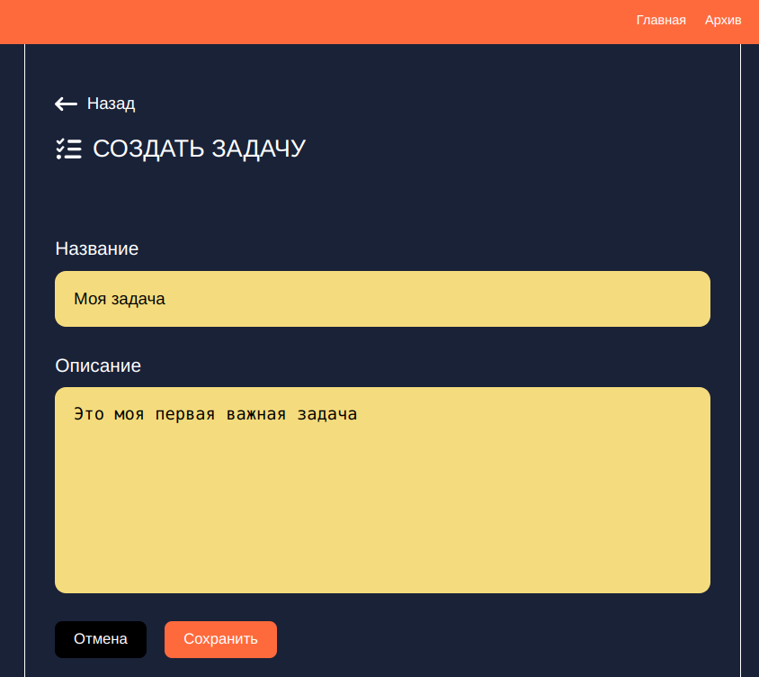
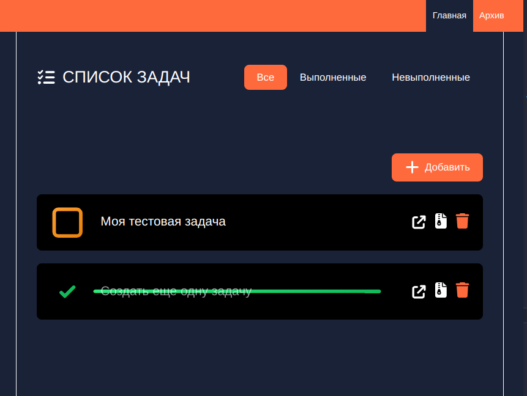
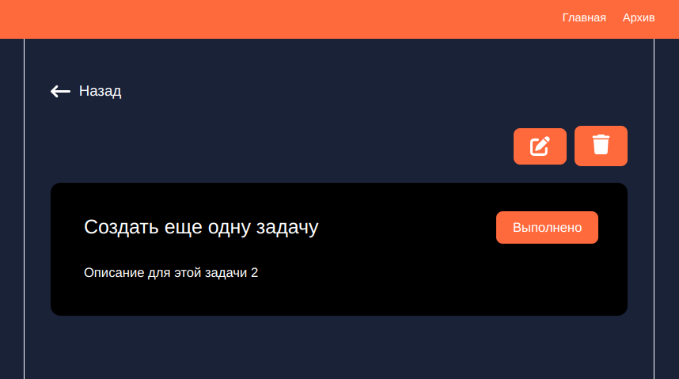

# MEVN-todo-app

## Описание проекта

Pet проект fullstack MEVN TODO app. Приложение список задач. На фронте есть страница с добавлением задачи. Страница просмотра текущих задач. Страница просмотра архивных задач. На бекенде написаны роуты, контроллеры, модели. Подключена БД MongoDB + Mongoose. Настроены middleware для проверки авторизации, обработка ошибок. Бекенд написан на Typescript

## Стек проекта

### Frontend

- Vue
- TS
- scss
- vue-router
- pinia
- axios
- prettier
- eslint

### Backend
- express
- express-validator
- mongoDB
- mongoose
- typescript
- node
- jsonwebtoken
- bcrypt
- 

## Установка проекта

```sh
npm install
```

## Запуск проекта

### Подготовка бекенда

Авторизуемся в mongodb.com создаем и запускаем кластер. Добавляем в папке server файл .env с настройками вашего кластера в mongoDB. Пример .env брать из файла .env.example. Запускаем сервер бекенда и фронт. Интерфейс авторизации и регистрации на фронте не реализован. Нужно через запрос в Postman зарегистрировать пользователя 

Отправляем POST запрос на регистрацию пользователя

```js
const url = '/api/auth/register'; 

const body = {
    "email": "test@test.ru",
    "nickname": "test1",
    "password": "qwerty1234"
}
```

Далее отправляем POST запрос на логин пользователя. Получаем токен в ответе

```js
const url = '/api/auth/login'; 

const body = {
    "email": "test@test.ru",
    "password": "qwerty1234"
}
```

Далее нужно отправить GET запрос по эндпоинту /me

```js
const url = '/api/auth/me'; 

const headers = {
    "authorization": "<token>",
}
```

### Запуск бекенда

```sh
npm run server
```

### Запуск frontend

```sh
npm run dev
```

### Сборка статики

```sh
npm run build
```


## Скриншоты проекта



